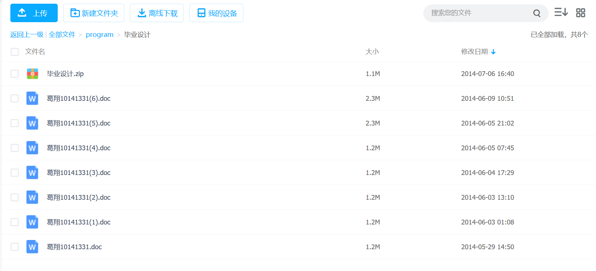

# 什么是Git?

Git是一个分布式版本控制系统. 版本控制是一种记录一个或多个文件内容变化,以便将来查阅特定版本情况得系统.

>在我们上大学时,每个人都有这样得经历,在写毕业论文时,一个版本一个版本修改.每当增加删除一些段落时,就将原来得版本备份一个,生怕过些时日又要用的里面得一些内容.
>
> <div align="center" >  </div>
>
> 或者我们是几个同学共同去完成一篇合作论文,就需要同学之间共享一个最新版本得论文.如何解决上述得问题.版本控制出现解决了这样得问题.
>
>
>| 版次 | 文件名 | 用户 | 说明 | 日期 |
>|---|------|----|-----|----|
>| 1 | 毕业论文.doc | Tim | 第一版本 | 2014.07.06 |
>| 2 | 毕业论文.doc | Tim | 第二版本 | 2014.07.07 |
>| 3 | 毕业论文.doc | Tim | 完成版 | 2014.07.09 |
>| 4 | 毕业论文.doc | Tim | 最终版 | 2014.07.13 |
>| 5 | 毕业论文.doc | Tim | 绝对不改版1 | 2014.07.15 |
>| 6 | 毕业论文.doc | Tim | 绝对不改版2 | 2014.07.16 |
>| 7 | 毕业论文.doc | Tim | 打死不改版 | 2014.07.17 |
>| 8 | 毕业论文.doc | Tim | 遗书 | 2014.07.21 |
>

- ## 版本管理系统
    - ### CVS 版本管理系统鼻祖
        CVS(Concurrent Versions System) 诞生于1985年,是由荷兰阿姆斯特丹VU 大学的Dick Grune教授实现的。当时Dick Grune和两个学生共同开发一个项目,但 是三个人的工作时间无法协调到一起,迫切需要一个记录和协同开发的工具软件。CVS成功地为后来的 版本控制系统确立了标准,像提交说明(commit log)、检入(checkin)、检出 (checkout)、里程碑(tag)、分支(branch)等概念在CVS中早就已经确立。 
    - ### SVN
        Subversion,由于其命令行工具名为svn,因此通常被简称为SVN。SVN由 CollabNet公司于2000年资助并开始开发,目的是创建一个更好用的版本控制系统以 取代CVS。SVN的前期开发使用CVS做版本控制.
    - ### Git
        在2002年以前，世界各地的志愿者把源代码文件通过diff的方式发给Linus，然后由Linus本人通过手工方式合并代码！

        因为Linus坚定地反对CVS和SVN，这些集中式的版本控制系统不但速度慢，而且必须联网才能使用。有一些商用的版本控制系统，虽然比CVS、SVN好用，但那是付费的，和Linux的开源精神不符。

        到了2005年,开发BitKeeper的商业公司同Linux内核开源社区的合作关系结束,他们收回了Linux内核社区免费使用BitKeeper的权力.这就迫使Linux开源社区(Linux Torvalds)基于使用BitKeeper时的经验开发出自己的版本系统.

     - ### Git开发过程
        * 2005年4月3日,开始开发Git.
	    * 2005年4月6日,项目发布. 
	    * 2005年4月7日,Git就可以作为自身的版本控制工具了. 
	    * 2005年4月18日,发生第一个多分支合并. 
	    * 2005年4月29日,Git的性能就已经达到了Linus的预期. 
        * 2005年6月16日,Linux内核2.6.12发布,那时Git已经在维护Linux核心的源代码了.
    
- ## Git特点
    - ### 记录快照而非差异
        (CVS、Subversion)将它们保存的信息看作是一组基本文件和每个文件随时间逐步累积的差异。

        <div align="center" > </div>
        
        Git 不按照以上方式对待或保存数据。 反之，Git 更像是把数据看作是对小型文件系统的一组快照。

        <div align="center"></div>

    - ### 几乎所有操作本地执行
        在 Git 中的绝大多数操作都只需要访问本地文件和资源，一般不需要来自网络上其它计算机的信息。 如果你习惯于所有操作都有网络延时开销的集中式版本控制系统，Git 在这方面会让你感到速度之神赐给了 Git 超凡的能量。 因为你在本地磁盘上就有项目的完整历史，所以大部分操作看起来瞬间完成。
    - ### 保存数据完成性
        Git 中所有数据在存储前都计算校验和，然后以校验和来引用。 这意味着不可能在 Git 不知情时更改任何文件内容或目录内容。 这个功能建构在 Git 底层，是构成 Git 哲学不可或缺的部分。 若你在传送过程中丢失信息或损坏文件，Git 就能发现。


# Git 基础 

- ## 安装

    **Windows**系统打开网页[https://git-scm.com/download/win](https://git-scm.com/download/win)会自动现在最新版本.

    Linux系统使用包管理工具.**redhat,centous,fedora** 使用 `yum install git` 或者 **ubuntu** 使用 `apt-get install git`

- ## 配置

    - ### 配置文件
      * /etc/gitcofig文件.系统级别每个用户及仓库得配置.
      * ~/.gitconfig文件.针对当前用户配置.
      * Git仓库中.git/config文件.针对该仓库配置.

      级别约到用户级别,优先级越高.可以覆盖上一级配置.

    - ### 配置及查看
  
        ```
        git config [--global|--system] 配置项 参数 #设置配置项
        git config 配置项 #查看单独配置项
        git config --list #查看所有配置
        git config --global --list #查看该用户配置
        ```

        配置用户信息
        ```
        $ git config --global user.name "John Doe"
        $ git config --global user.email johndoe@example.com
        ```

    - ### 设置git别名

        git完整命令还是有点长的,我们可以通过别面方式化简操作.

        * git config --global alias.co checkout
        * git config --global alias.br branch
        * git config --global alias.ci commit
        * git config --global alias.st status
        * git config --global alias.last 'log -1 HEAD' #查看最后一次提交日志

        ``` 
        $ git last
        commit 026dd738a6e5f1e42ef0f390feacb5ed6acc4ee8
        Author: Junio C Hamano <gitster@pobox.com>
        Date:   Mon Jul 29 12:51:24 2019 -0700

        Git 2.23-rc0

        Signed-off-by: Junio C Hamano <gitster@pobox.com>
        ```

- ## 获取仓库

    - ### 初始化现有项目
  
        ```
        $ cd project;
        $ git init
        ```

    - ### 克隆已有项目

        ```
        $ git clone url
        ```

        如果你想参与一个已有项目开发,这时就要用到git clone命令. 如果你对Subversion很熟悉,它的获取代码的命令就不是"clone"而不是"checkout". 这是Git区别于其它版本控制系统的一个重要特性,Git克隆的是该Git仓库服务器上的几乎所有数据,而不是仅仅复制完成你的工作所需要文件.


