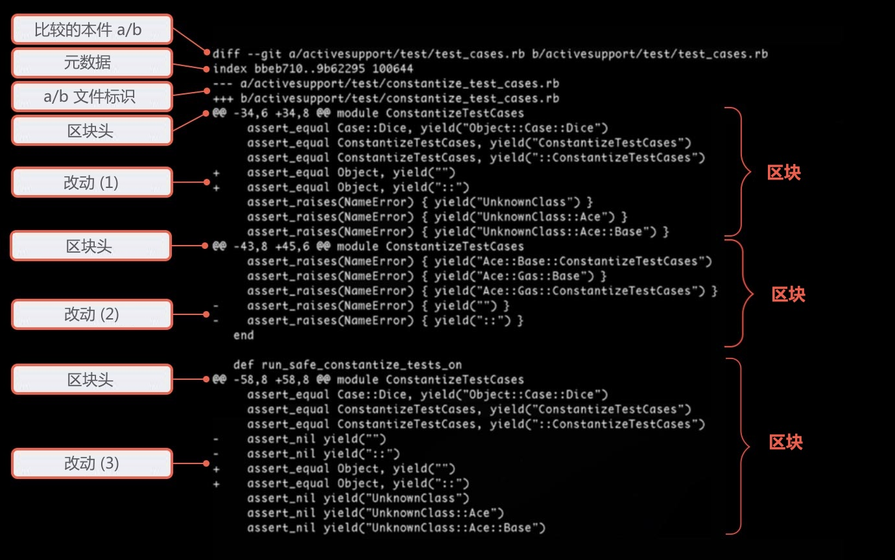
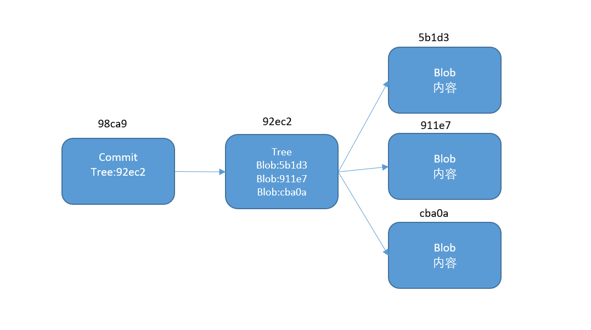

[Git是什么](#Git是什么)
  - [版本管理系统](#版本管理系统)
  - [Git特点](#Git特点)

[Git基础](#Git基础)
  - [安装](#安装)
  - [配置](#配置)
  - [获取仓库](#获取仓库)
  - [提交内容](#提交内容)
  - [删除文件](#删除文件)
  - [忽略文件](#忽略文件)
  - [查看修改](#查看修改)
  - [查看历史](#查看历史)

[分支](#分支)
  - [分支简介](#分支简介)
  - [分支合并](#分支合并)
  - [解决合并时的冲突](#解决合并时的冲突)
  - [分支使用方式](#分支使用方式)

[远程仓库](#远程仓库)
  - [克隆远程仓库](#克隆远程仓库)
  - [查看远程仓库](#查看远程仓库)
  - [添加远程仓库](#添加远程仓库)
  - [从远端抓取或者拉取](#从远端抓取或者拉取)
  - [推送到远程仓库](#推送到远程仓库)
  - [查看某个远程仓库](#查看某个远程仓库)
  - [远程分支](#远程分支)
  - [跟踪分支](#跟踪分支)
  - [删除远端分支](#删除远端分支)
  - [分布式协作工作流程](#分布式协作工作流程)

[撤销修改](#撤销修改)
  - [重置最后一次提交](#重置最后一次提交)
  - [取消暂存的文件](#取消暂存的文件)
  - [撤销文件修改](#撤销文件修改)
  - [撤销如何实现的](#撤销如何实现的)

[Git内部概念](#Git内部概念)
  - [Git对象](#Git对象)
  - [树对象](#树对象)
  - [提交对象](#提交对象)
  - [Git引用](#Git引用)

# Git是什么?

Git是一个分布式版本控制系统.

版本控制就是对文件变更过程的管理.说白了,版本控制就是要把一个文件或一些文件的各个版本按一定的方式管理起来,目的是需要用到某个版本的时候可以随时检索出来.

分布式是相对于集中式来说的, Git 的数据不止保存在服务器上,同时也完整的保存在本地计算机上,所以我们称Git为分布式版本控制系统.

>在我们上大学时,每个人都有这样得经历,在写毕业论文时,一个版本一个版本修改.每当增加删除一些段落时,就将原来得版本备份一个,生怕过些时日又要用的里面得一些内容.
>
> <div align="left" >  </div>
>
> 或者我们是几个同学共同去完成一篇合作论文,就需要同学之间共享一个最新版本得论文.如何解决上述得问题.版本控制出现解决了这样得问题.
>
>
>| 版次 | 文件名 | 用户 | 说明 | 日期 |
>|---|------|----|-----|----|
>| 1 | 毕业论文.doc | Tim | 第一版本 | 2014.07.06 |
>| 2 | 毕业论文.doc | Tim | 第二版本 | 2014.07.07 |
>| 3 | 毕业论文.doc | Tim | 完成版 | 2014.07.09 |
>| 4 | 毕业论文.doc | Tim | 最终版 | 2014.07.13 |
>| 5 | 毕业论文.doc | Tim | 绝对不改版1 | 2014.07.15 |
>| 6 | 毕业论文.doc | Tim | 绝对不改版2 | 2014.07.16 |
>| 7 | 毕业论文.doc | Tim | 打死不改版 | 2014.07.17 |
>| 8 | 毕业论文.doc | Tim | 遗书 | 2014.07.21 |
>

- ## 版本管理系统
    - ### CVS 版本管理系统鼻祖
        CVS(Concurrent Versions System)诞生于1985年,是由荷兰阿姆斯特丹大学的Dick Grune教授实现的.当时Dick Grune和两个学生共同开发一个项目,但是三个人的工作时间无法协调到一起,迫切需要一个记录和协同开发的工具软件.CVS成功地为后来的版本控制系统确立了标准,像提交说明(commit log),检入(checkin),检出(checkout),里程碑(tag),分支(branch)等概念在CVS中早就已经确立. 

    - ### SVN
        Subversion,SVN由CollabNet公司于2000年资助并开始开发,目的是创建一个更好用的版本控制系统以取代CVS.

    - ### Git
        在2002年以前，世界各地的志愿者把源代码文件通过diff的方式发给Linus，然后由Linus本人通过手工方式合并代码！

        因为林纳斯·托瓦兹(Linus Torvalds)坚定地反对CVS和SVN，这些集中式的版本控制系统不但速度慢,而且必须联网才能使用.有一些商用的版本控制系统,虽然比CVS,SVN好用,但那是付费的,和Linux的开源精神不符.

        到了2005年,开发BitKeeper的商业公司同Linux内核开源社区的合作关系结束,他们收回了Linux内核社区免费使用BitKeeper的权力.这就迫使Linus基于使用BitKeeper时的经验开发出自己的版本系统.

        <div align="center"></div>

     - ### Git开发过程
        * 2005年4月3日,开始开发Git.
	    * 2005年4月6日,项目发布. 
	    * 2005年4月7日,Git就可以作为自身的版本控制工具了. 
	    * 2005年4月18日,发生第一个多分支合并. 
	    * 2005年4月29日,Git的性能就已经达到了Linus的预期. 
        * 2005年6月16日,Linux内核2.6.12发布,那时Git已经在维护Linux核心的源代码了.
    
- ## Git特点

    - ### 记录快照而非差异
        (CVS、Subversion)将它们保存的信息看作是一组基本文件和每个文件随时间逐步累积的差异。

        <div align="center" > </div>
        
        Git 不按照以上方式对待或保存数据. Git 更像是把数据看作是对小型文件系统的一组快照。

        <div align="center"></div>

    - ### 几乎所有操作本地执行
        在 Git 中的绝大多数操作都只需要访问本地文件和资源，一般不需要来自网络上其它计算机的信息. 

    - ### 保存数据完成性
        Git 中所有数据在存储前都计算校验和，然后以校验和来引用. 这意味着不可能在 Git 不知情时更改任何文件内容或目录内容. Git 使用的散列算法为 `SHA-1` (Secure Hash Algorithm 1) .


# Git基础 

- ## 安装

    **Windows**系统打开网页[https://git-scm.com/download/win](https://git-scm.com/download/win)会自动现在最新版本.

    Linux系统使用包管理工具.**redhat,centous,fedora** 使用 `yum install git` 或者 **ubuntu** 使用 `apt-get install git`

- ## 配置

    - ### 配置文件
      * /etc/gitcofig文件 #系统级别仓库得配置.
      * ~/.gitconfig文件 #针对当前用户配置.
      * Git仓库中.git/config文件 #针对该仓库配置.

      级别约到用户级别,优先级越高.可以覆盖上一级配置.

    - ### 配置及查看
  
        ```
        git config [--global|--system] 配置项 参数 #设置配置项
        git config 配置项 #查看单独配置项
        git config --list #查看所有配置
        git config --global --list #查看该用户配置
        git config -e --global #编辑该用户的配置
        git config -e --system #编辑系统级配置
        ```

        配置用户信息
        ```
        $ git config --global user.name "John Doe"
        $ git config --global user.email johndoe@example.com
        ```

    - ### 设置Git别名

        Git 完整命令还是有点长的,我们可以通过别面方式化简操作.

        * git config --global alias.co checkout
        * git config --global alias.br branch
        * git config --global alias.ci commit
        * git config --global alias.st status
        * git config --global alias.last 'log -1 HEAD' #查看最后一次提交日志

        ``` 
        $ git last
        commit 026dd738a6e5f1e42ef0f390feacb5ed6acc4ee8
        Author: Junio C Hamano <gitster@pobox.com>
        Date:   Mon Jul 29 12:51:24 2019 -0700

        Git 2.23-rc0

        Signed-off-by: Junio C Hamano <gitster@pobox.com>
        ```

- ## 获取仓库

    - ### 初始化现有项目
  
        ```
        $ cd project;
        $ git init
        ```

    - ### 克隆已有项目

        ```
        $ git clone url
        ```

        如果你想参与一个已有项目开发,这时就要用到git clone命令. 如果你对SVN很熟悉,它的获取代码的命令是"checkout". Git 克隆的是该Git仓库服务器上的几乎所有数据,而不是仅仅复制完成你的工作所需要文件.

- ## 提交内容

  - ### 三种状态

    Git的文件有三种状态,我们的文件可能处于其中之一:已提交(committed),已修改(modified)和已暂存(staged).

    

    处于工作目录的文件通过 `add` 命令转化状态为已暂存. 已暂存的文件通过 `commit` 命令转化为已提交状态. 编辑已提交或者暂存区的文件,其状态转化为已修改.

  - ### 检查文件状态

    ```
    $ git status
    # On branch master
    # Initial commit
    nothing to commit (create/copy files and use "git add" to track)
    ```

    提示工作目录很干净,没有未跟踪的文件和修改的文件.同时还显示了当前分支在`master`

    ```
    $ echo "# Git basic" > README.md
    $ git ss
    # On branch master
    # Initial commit
    # Untracked files:
    #   (use "git add <file>..." to include in what will be committed)
    #
    #       README.md
    nothing added to commit but untracked files present (use "git add" to track)
    ```

    我们新增一个`README.md`文件,然后使用状态查看命令.然后文件出现在未跟踪的文件中.需要显示的表明我想跟踪它之后才会纳入暂存区. 由于我们编译程序会产生一些二进制文件,不是出现在我们工作目录中的文件就会被跟踪的.

  - ### 跟踪文件

    ```
    $ git add README.md
    $ git ss
    # On branch master
    # Initial commit
    # Changes to be committed:
    #   (use "git rm --cached <file>..." to unstage)
    #
    #       new file:   README.md
    ```

    `git add`命令将指定的文件纳入跟踪,将其放入缓存区.

  - ### 提交更新
  
    ```
    $ git commit -m 'first commit add readme file'
    [master (root-commit) 7702aa7] first commit add readme file
    1 file changed, 1 insertion(+)
    create mode 100644 README.md

    $ git ss
    # On branch master
    nothing to commit, working directory clean
    ```

    `git commit`将放入缓存区的文件提交到Git仓库中纳入版本管理中.

  - ### 修改已提交文件
  
    ```
    $ echo "  Git Is Distributed VCS." >> README.md

    $ git ss
    # On branch master
    # Changes not staged for commit:
    #   (use "git add <file>..." to update what will be committed)
    #   (use "git checkout -- <file>..." to discard changes in working directory)
    #
    #       modified:   README.md
    #
    no changes added to commit (use "git add" and/or "git commit -a")
    ```

    修改已提交的文件,使用 `git status` 查看状态,说明这个提交的文件内容发生变化,但是还没有放入暂存区,需要使用 `git add` 命令将已跟踪被修改文件放入暂存区,为下次提交做准备.

    ```
    $ git add README.md
    $ echo "  Git Was Created By Liuns Torvalds In 2005." >> README.md

    $ git ss
    # On branch master
    # Changes to be committed:
    #   (use "git reset HEAD <file>..." to unstage)
    #
    #       modified:   README.md
    #
    # Changes not staged for commit:
    #   (use "git add <file>..." to update what will be committed)
    #   (use "git checkout -- <file>..." to discard changes in working directory)
    #
    #       modified:   README.md
    ```
    
    如果在 `README.md` 文件再添加一些内容,使用 `git status` 命令查看状态,发现 `README.md` 文件出现在了暂存区和非暂存区. `git add` 命令其实将当时一个版本存入暂存区.当你 `git commit` 其实只是将暂存区的文件提交到Git仓库中.

  - ### 简短状态

    ```
    $ touch .gitignore
    $ touch aa
    $ git ss -s
    MM README.md
    ?? .gitignore
    ?? aa

    $ git add .
    $ git ss -s
    A  .gitignore
    M  README.md
    A  aa

    $ git ci -m 'second commit'
    ```

    又创建了两个文件,将 `.gitignore` 文件加入了暂存区.使用 `git status -s` 命令可以看到左侧列出文件的状态. `M` 代表文件有修改, `A` 代表文件添加到暂存区, `??` 代表文件没有被跟踪.右边的 `M` 代表文件修改还有没加入暂存区,左边 `M` 代表文件文件修改了并放入了暂存区.

- ## 删除文件

    要想从Git中移除某个文件,就必须要从已跟踪文件清单中移除,然后就可以提交.

    ```
    $ git rm aa
    rm 'aa'
    $ git ss
    # On branch issue
    # Changes to be committed:
    #   (use "git reset HEAD <file>..." to unstage)
    #
    #       deleted:    aa
    #

    $ git ci -m 'delete aa'
    [master ad6f932] delete aa
    1 file changed, 0 insertions(+), 0 deletions(-)
    delete mode 100644 aa
    ```

- ## 忽略文件
  
    有时候我们有些文件不需要加入Git版本管理.像上面例子中我们往 `.gitignore` 写入带通配符的字符之后, `git status` 就忽略了满足条件的文件.

    ```
    $ vim hello.cpp 

    #include <cstdio>
    int main(){
        printf("hello world!\n");
    }

    $ g++ hello.cpp

    $ git ss - s
    ?? a.out
    ?? hello.cpp

    $ echo "*.out" >> .gitignore

    $ git ss -s
     M .gitignore
    ?? hello.cpp

    $ git add .
    $ git ci -m 'add ignore'
    [master cd3df92] add ignore
    2 files changed, 5 insertions(+)
    create mode 100644 hello.cpp
    ```

    * 所有空行或者#开头的都将忽略.
    * 使用glob模式匹配,glob是shell使用的路径匹配符,类似与正则.
    * *:匹配路径中的0个或者多个文件.
    * ?:匹配一个字符.
    * \[...]:匹配一系列字符.[abc]匹配abc中任意一个.[a-z],[0-9]范围匹配.
    * **:可匹配0个或者多个文件夹.
    * !:排除文件.
    * /:以/开头可以防止递归,以/结尾可以匹配指定目录.

    ```
    # no .a files
    *.a

    # but do track lib.a, even though you're ignoring .a files above
    !lib.a

    # only ignore the TODO file in the current directory, not subdir/TODO
    /TODO

    # ignore all files in the build/ directory
    build/

    # ignore doc/notes.txt, but not doc/server/arch.txt
    doc/*.txt

    # ignore all .pdf files in the doc/ directory
    doc/**/*.pdf
    ```

- ## 查看修改

    如果两个文件相似度很高,那么上下文格式的diff,将显示大量重复的内容,很浪费空间.1990年,GNU diff率先推出了"合并格式"的diff,将f1和f2的上下文合并在一起显示.

    ```
    # 使用编辑器将第最后一行的.换成!

    $ git diff
    diff --git a/README.md b/README.md
    index 281f5d2..723f741 100644
    --- a/README.md
    +++ b/README.md
    @@ -1,3 +1,3 @@
    # Git Basic
    Git Is Distributed VCS.
    -  Git Was Created By Linus Torvalds In 2005.
    +  Git Was Created By Linus Torvalds In 2005!
    ```

    此命令比较的是工作目录中当前文件和暂存区域快照之间的差异,也就是修改之后还没有暂存起来的变化内容.

    `index d61d399..9170b16 100644` 表示两个版本SHA-1值,
    前面的是缓存区,后面是工作目录.

    `--- a/README.md +++b/README.md` 表示 `---` 表示变动前文件, `+++` 表示变动后文件.

    `@@ -1,2 +1,3 @@` `@@`是首位标记, `-1,3` 表示变动前文件从第一行开始后的3行内容. `+1,3` 表示变动后文件从第一行开始后的3行内容.

    剩余内容为变更内容,前面带 `-` 号的代表变动前文件内容.前面带 `+` 号的代表变动后文件内容.

    <div align="left"></div>

    要查看已暂存的将要添加到下次提交里的内容,使用`--cached`

    ```
    $ git diff --cached
    ```

    要查看工作区与最新版本库的差异 

    ```
    $ git diff HEAD
    ```

    要查看最后两次提交的差异, `HEAD` 表示当前版本,`HEAD^` 表示上一版本 , `HEAD^^` 表示上上一版本. `HEAD~3` 表示上上上一版本.

    ```
    $ git diff HEAD^ [-- file]
    ```

 - ## 查看历史

    `git log`

    常用参数:
    * -p: 显示每个版本之间的差异
    * --stat: 显示更行的文件修改统计信息
    * --graph: 显示ASCII图形表示的分支合并历史
    * --pretty: 使用其他显示历史提交信息.oneline,short,full,fuller,format. 

    ```
    $ git log --pretty=short -stat
    ```

# 分支

- ## 分支简介

    用分支意味着你可以把你的工作从开发主线上分离开来,以免影响开发主线.

    ```
    $ git branch branchname 从当前快照创建一个分支
    $ git branch 查看已有分支和当前分支
    $ git branch -v 查看每个分支最后一次提交
    $ git branch -d branchname 删除分支 
    ```

    <div align="center"></div>

    当使用 `git commit` 进行提交操作时,Git 先创建一个树对象.树对象存储该目录下所有文件的校验值,然后 Git 创建一个提交对象,它包含指向这个树对象的指针. Git 就可以在需要的时候重现此次保存的快照.

    <div align="center"></div>

    再做些修改后再次提交,每次产生的提交对象会包含一个指向上次提交对象的指针.

    Git 的分支其本质是指向提交对象的可变指针.Git 默认分支名字是 `master` 在多次提交操作之后,你其实已经有一个指向最后那个提交对象的 `master` 分支.它会在每次的提交操作中自动向前移动.

    <div align="center"></div>

    我们创建了开始创建一个 `testing` 分支.然后 Git 怎么知道自己在那个分支上呢?通过 `HEAD` 特殊指针,它指向当前所在的本地分支.

    <div align="center"></div>

    我们创建了一个分支, `HEAD` 还指向 `master` ,只有切换分支之后才能指向我们新的分支.

    <div align="center"></div>

    当我们在 `testing` 分支再提交一次内容时, `HEAD` 随着提交也向前移动.但是 `master` 还是在原来分支没有动.

    <div align="center"></div>

    当使用 `git checkout` 命令时,首先将 `HEAD` 指向 `master` ,然后将工作目录恢复成 `master` 分支所指向的快照内容.

    我们再提交一个更改,这时项目的提交历史产生了分叉,我们可以在不同的分支切换工作,并在合适时机把他们合并起来.

- ## 分支合并

    我们将会展示一个简单分支创建和合并的例子,这个在平时工作中会经常遇到类似的工作流程.

    1. 假设我们有一个 `pintf("hello world!\n")` 的程序.
    2. 现在需要实现一个 `issue` 在下一行打印一行 `hello git`.
    3. 就在完成 `issue` 这个需求的过程中需要修补一个很严重的bug.需要将 `master` 分支上的"hello world"改成首字母大写.
    4. 为了这个紧急的任务建立了一个新的分支,完成任务并且测试.
    5. 然后合并这个修改分支到 `master`.
    6. 完成修补之后切换回 `issue` 分支继续新需求的开发.

    </br>

    <div align="center"></div>

    我们开始在 `master` 分支上,创建一个 `issue` 分支并且切换过去,在 `issue` 分支中完善新的内容.

    ```
    $ git checkout -b issue
    Switched to a new branch 'issue'

    # edit hello.cpp add printf("hello git!\n"); next line

    $ git ci -a -m 'add new line'
    [issue 995a1fb] add new line
    1 file changed, 1 insertion(+)
    ```

    <div align="center"></div>

    此时接到通知需要修改 `master` 分支上的一个紧急bug.在切换之前确保工作区和暂存区已经都提交了,因为切换分支的时候会将工作区和暂存区覆盖掉.

    ```
    $ git checkout master
    $ git checkout -b hotfix

    # edit hello.cpp changed 4 line printf("Hello World!\n");

    $ git ci -a -m 'fix bug'
    ```

    <div align="center"></div>

    当 `hotfix` 分支内容测试没有问题之后,就可以合并到 `master` 部署上线了.当我们要解决完这个任务需要切换回原来的分支完成原来的需求, `git branch -d hotfix`命令删除分支.

    如果顺着一个分支走下去能够到达另一个分支,那么Git在合并两者的时候,只会简单的将指针向前推进,因为这种情况下的合并操作没有需要解决的分歧 快进(fast-forward).

    ```
    $ git co master
    $ git merge hotfix
    Updating 14d54f9..119d850
    Fast-forward
    hello.cpp | 2 +-
    1 file changed, 1 insertion(+), 1 deletion(-)

    $ git branch -d hotfix
    Deleted branch hotfix (was f21f8c0).
    ```

    <div align="center"></div>

    假如我们已经完成了 `issue` 的功能,现在需要合并到 `master` 分支中,此时合并分支就和 `hotfix` 不太一样了.这时分支在一个更早的地方发生了分离, `master` 不是 `issue` 的直接祖先.所以 Git 需要使用3个提交来完成这次的合并,一个共同祖先提交,和各个分支的头提交. 三方合并之后作为一个新的快照并且创建一个新的提交指向它,此时`C5`提交有两个父提交.

    ```
    $ git merge issue
    Auto-merging hello.cpp
    CONFLICT (content): Merge conflict in hello.cpp
    Automatic merge failed; fix conflicts and then commit the result.
    ```

- ## 解决合并时的冲突

    有时候合并没有那么顺利,出现在两个分支对同一部分进行修改,就如我们 `master` 分支修改大写,紧接着下一行增加了新的内容,Git在合并时遇见连续两行都修改了就无法自动合并了.

    ```
    int main(){
    4 <<<<<<< HEAD
    5     printf("Hello World!\n");
    6 =======
    7     printf("hello world!\n");
    8     printf("hello git!\n");
    9 >>>>>>> issue
    10 }
    ```

    `<<<<<<<<< HEAD` 所分割的版本为当前分支版本,对于这次合并也就是 `master` 分支, `>>>>>>>> issue` 部分就是被合并的分支. 为了解决冲突,我们必须使用`==========`中的一部分或者自行保留删除内容.

    如果你修改成满意的结果,就可以将这次冲突文件提交来完成合并并提交.

    ```
    3 int main(){
    4     printf("Hello World!");
    5     printf("hello git!");
    6 }

    $ git ci -a -m 'resolve confilct'
    [master 441c2b4] resolve confilct

    $git log --graph --stat --pretty=oneline

    *   f254c5acff4696a6b7b0b54938895983b85532da resolve conflict
    |\
    | * 27a5340a4b2b3f555b3a8c24a96efad2d0d24285 add hello git
    | |  hello.cpp | 3 ++-
    | |  1 file changed, 2 insertions(+), 1 deletion(-)
    * | f21f8c03f4d8b8cb763bf478ff0a05ae7b2fcf0c fix bug
    |/
    |    hello.cpp | 2 +-
    |    1 file changed, 1 insertion(+), 1 deletion(-)
    * 43656af4d9232b21ff870c877de6f3c250639989 add ignore
    |  .gitignore | 1 +
    |  README.md  | 4 ++--
    |  hello.cpp  | 4 ++++
    |  3 files changed, 7 insertions(+), 2 deletions(-)
    * 57f6604a32fcbf123ae2dca26db2e048054487f5 delete aa
    |  aa | 0
    |  1 file changed, 0 insertions(+), 0 deletions(-)
    * d2e7feacaa3a8b31f329c4fefacb89d5eaad55e1 second commit
    |  .gitignore | 0
    |  README.md  | 2 ++
    |  aa         | 0
    |  3 files changed, 2 insertions(+)
    * fd32c808c771700b6d510e88f222964b78bbd629 first commit

    ```

- ## 分支使用方式

  - ### 永久分支

    只在 `master` 分支上保留完全稳定的代码.他们还有一些名为 `develop` 或者 `next` 的平行分支,被用来做后续开发或者测试稳定性,这些分支不必保持绝对稳定,但是一旦达到稳定状态,它们就可以被合并入 `master` 分支了.

    <div align="center"></div>

  - ### 特性分支

    特性分支对任何规模的项目都适用.特性分支是一种短期分支,它被用来实现单一特性或其相关工作.类似刚才分支合并例子. `issue` 和 `hotfix` 每个分支都有他们单独的需求,当这个需求开发完成之后合并到主分支之后,该分支的使命也将完成.

# 远程仓库

为了能让Git在工作上协作,我们需要引入远程仓库的概念.远程仓库是在网络中你的项目的版本库.


<div align="center"></div>

- ## 克隆远程仓库

    ```
    $ cp -a project remote-project
    $ git clone  file:///root/remote-project local-project
    Cloning into 'local-project'...
    remote: Counting objects: 23, done.
    remote: Compressing objects: 100% (18/18), done.
    Receiving objects: 100% (23/23), 1.69 KiB | 0 bytes/s, done.
    Resolving deltas: 100% (7/7), done.
    remote: Total 23 (delta 7), reused 0 (delta 0)
    ```

    使用 `git clone` 命令克隆网络中的一个仓库,本例中使用的是本地仓库.

- ## 查看远程仓库

    ```
    $ git remote
    origin

    $ git remote -v
    origin  file:///root/project (fetch)
    origin  file:///root/project (push)
    ```

    此时能看到 `origin` ,Git 默认给你远程仓库起的名字.

- ## 添加远程仓库

    ```
    $ git remote add other file:///root/project 
    $ git remote -v
    origin  file:///root/remote-project (fetch)
    origin  file:///root/remote-project (push)
    other   file:///root/project (fetch)
    other   file:///root/project (push)
    ```

    由于 Git 是分布式特性,所以支持可以从多个仓库拉去内容,或者将提交推送到多个仓库去.

- ## 从远端抓取或者拉取

    `git fetch` 命令可以将远程仓库中你本地仓库还没有的数据.它只会拉去数据内容到本地仓库,不会自动合并到你当前目录中.

    ```
    # 在Project文件夹中编辑hello.cpp增加内容并提交, printf("test fetch!\n");
    $ vi hello.cpp
    $ git ci -a -m 'test fetch'
    [master a9683f0] test fetch
    1 file changed, 1 insertion(+)

    # 切换当前目录到local-project, fetch origin
    $ git fetch origin
     git fetch origin
    remote: Counting objects: 5, done.
    remote: Compressing objects: 100% (3/3), done.
    remote: Total 3 (delta 2), reused 0 (delta 0)
    Unpacking objects: 100% (3/3), done.
    From file:///root/remote-project
    f254c5a..bd732ab  master     -> origin/master

    # 查看当前目录的hello.cpp还是原来内容
    $ git merge origin/master
    Updating 441c2b4..a9683f0
    Fast-forward
    hello.cpp | 1 +
    1 file changed, 1 insertion(+)
    ```

    运行 `git pull` 会从初克隆的服务器上抓取数据并自动尝试合并到当前所在的分支.

    ```
    # 在Project文件夹中编辑hello.cpp增加内容并提交
    $ git ci -a -m 'test pull'
    [master ed9da8e] test pull
    1 file changed, 1 insertion(+)

    # 切换当前目录到local-project,执行 git pull
    $ git pull
    remote: Counting objects: 5, done.
    remote: Compressing objects: 100% (3/3), done.
    remote: Total 3 (delta 2), reused 0 (delta 0)
    Unpacking objects: 100% (3/3), done.
    From file:///root/remote-project
    a9683f0..ed9da8e  master     -> origin/master
    Updating a9683f0..ed9da8e
    Fast-forward
    hello.cpp | 1 +
    1 file changed, 1 insertion(+)

    # 观察 hello.cpp文件内容
    ```

- ## 推送到远程仓库

    ```
    git push [remote-name] [branch-name]

    $ git push origin master
    ```

    只有当你有所克隆服务器的写入权限,并且之前没有人推送过时,这条命令才能生效. 当你和其他人在同一时间克隆,他们先推送到上游然后你再推送到上游,你的推送就会毫无疑问地被拒绝.你必须先将他们的工作拉取下来并将其合并进你的工作后才能推送.

- ## 查看某个远程仓库
  
    ```
    git remote show [remote-name]
    ```

    它会告诉你远远程仓库当前的分支为 `issue` ,远程仓库有那些分支.
     `git pull` 那些分支, l`git push` 那些分支. 

    ```
    $ git remote show origin
    * remote origin
    Fetch URL: file:///root/remote-project
    Push  URL: file:///root/remote-project
    HEAD branch: issue
    Remote branches:
        issue  tracked
        master tracked
    Local branches configured for 'git pull':
        issue  merges with remote issue
        master merges with remote master
    Local refs configured for 'git push':
        issue  pushes to issue  (up to date)
        master pushes to master (up to date)
    ```

- ## 远程分支

    远程引用是对远程仓库的引用(指针),包括分支,标签等等.

    远程分支是远程仓库分支的引用.它们是不能移动的本地引用,当你做任何网络通信操作时,它们会自动移动.远程跟踪分支像是你上次连接到远程仓库时,那些分支所处状态的书签.


    远程分支使用 `(remote)/(branch)` 形式表示,如果你想看你最后一次与远程仓库origin通信时 `master` 分支状态,可以查看 `origin/master` 分支.

    <div align="center"></div>

    当我们local-project第一次克隆仓库时,远程分支 `origin-master` 和本地 `master` 分支都指向 `C1`.

    <div align="center"></div>

    如果你在本地 `master` 分支开发了 `C4 C5` 内容.与此同时,其他人将他们修改 `C2 C3` 推送至服务器.那么你远程 `origin/master` 分支将不会继续前进.只要你不和服务器连接,那么远程分支就不会动.

    <div align="center"></div>

    如果要同步别人的工作内容,使用 `git fetch origin` ,从远程服务器抓取本地没有的数据,移动 l`origin/master` 到更新后的位置.然后可以是使用 `git merge` 命令将 `origin/master` 合并到本地`master`.

- ## 跟踪分支

    从一个远程跟踪分支检出一个本地分支会自动创建跟踪分支, 跟踪分支是与远程分支有联系的分支.如果在一个跟踪分支上输入 `git pull` ,Git 能自动地识别去哪个服务器上抓取,合并到哪个分支.

    当克隆一个仓库时,它通常会自动地创建一个跟踪 `origin/master` 的 `master` 分支.可以通过如下方式创建跟踪分支.
    
    ```
    git checkout -b [branch] [remotename]/[branch]
    git checkout --track [remotename]/[branch]

    $ git branch -d issue
    $ git branch
    * master
  
    $ git branch -b issue origin/issue
    ```

    查看当前仓库设置的所有跟踪分支,可以使用:

    ```
    $ git branch -vv
    * issue  9d91665 [origin/issue] resolve conflict
    master 423f0b9 [origin/master] test pull

    # 复制项目
    cp -a local-project twice-project

    #twice-project 项目编辑文件并push
    $ vi hello.cpp
    $ git ci -a -m 'add something'
    $ git push origin issue

    #local-project 项目fetch orgin
    $ git fetch origin 
    remote: Counting objects: 5, done.
    remote: Compressing objects: 100% (3/3), done.
    remote: Total 3 (delta 2), reused 0 (delta 0)
    Unpacking objects: 100% (3/3), done.
    From file:///root/remote-project
    c68f91b..35cae88  issue      -> origin/issue


    $ git branch -vv
    * issue  c68f91b [origin/issue] add black line
    master ed9da8e [origin/master] test pull
    issue  292a705 [origin/issue: ahead 1, behind 1] add some line
    ```

    远端分支后有`ahead 1` 和 `behind 1` 意为这本地分支还有1个提交没有push,远端分支还有一个分支没有pull下来.


- ## 删除远端分支

    假设你已经通过远程分支做完所有的工作了,也就是说你和你的协作者已经完成了一个特性并且将其合并到了远程仓库的`master`分支.我们就可以将远端的特性分支删除

    ```
    git push origin --delete [branchname]
    ```

- ## 分布式协作工作流程

    - ### 集中式

    <div align="center"></div>

    一个中心仓库,可以接受代码,所有人将自己的工作与之同步.

    如果两个开发者从中心仓库克隆代码下来,同时作了一些修改,那么只有第一个开发者可以顺利地把数据推送回共享服务器. 第二个开发者在推送修改之前,必须先将第一个人的工作合并进来,这样才不会覆盖第一个人的修改.

    - ### 集成管理者

    <div align="center"></div>

    Git 允许多个远程仓库存在,每个开发者拥有自己仓库的写权限和其他所有人仓库的读权限.这种情形下通常会有个代表"官方"项目的权威的仓库.要为这个项目做贡献,你需要从该项目克隆出一个自己的公开仓库,然后将自己的修改推送上去.
    
    接着你可以请求官方仓库的维护者拉取更新合并到主项目.维护者可以将你的仓库作为远程仓库添加进来,在本地测试你的变更,将其合并入他们的分支并推送回官方仓库.

    这是 GitHub 和 GitLab 最常用的工作流程。


# 撤销修改

- ## 重置最后一次提交

    ```
    git commit --amend
    ```
    有时候我们提交完了才发现漏掉了几个文件没有添加，或者提交信息写错了。
    
- ## 取消暂存的文件

    假设你已经修改了两个文件并且想要将它们作为两次独立的修改提交,但是却意外地输入了 git add * 暂存了它们两个.

    ```
    $ touch a
    $ vi hello.cpp
    $ git add *
    $ git ss
    # On branch issue
    # Changes to be committed:
    #   (use "git reset HEAD <file>..." to unstage)
    #
    #       new file:   a
    #       modified:   hello.cpp
    #

    $ git reset HEAD hello.cpp
    Unstaged changes after reset:
    M       hello.cpp

    $ git ss
    # On branch issue
    # Changes to be committed:
    #   (use "git reset HEAD <file>..." to unstage)
    #
    #       new file:   a
    #
    # Changes not staged for commit:
    #   (use "git add <file>..." to update what will be committed)
    #   (use "git checkout -- <file>..." to discard changes in working directory)
    #
    #       modified:   hello.cpp
    #
    ```

- ## 撤销文件修改

    如果不想保留`hello.cpp`文件的修改还原成上一次提交的样子.

    ```
    $ git checkout -- hello.cpp
    $ git ss
    # On branch issue
    # Changes to be committed:
    #   (use "git reset HEAD <file>..." to unstage)
    #
    #       new file:   a
    #

    $ git reset HEAD a
    it ss
    # On branch issue
    # Untracked files:
    #   (use "git add <file>..." to include in what will be committed)
    #
    #       a
    ```

- ## 撤销如何实现的

    Git 内部管理者如下三种文件结构

    |结构|用途|
    |---|-----|
    |HEAD|上一次提交的快照, 下一次提交的父节点| 
    |Index|预期的下次提交的快照| 
    |工作区| 添加修改文件区域|

    - ### HEAD

        `HEAD` 是当前分支引用的指针,它总是指向该分支上的最后一次提交快照.也可以说 `HEAD` 将是下一次提交的父结点.

    - ### 索引(暂存区)

        索引是你的预期的下一次提交. 我们也会将这个概念引用为 Git 的暂存区域,这就是当你运行 `git commit` 时 Git 看起来的样子.使用 `git ls-files -s` 底层命令来查看当前索引.

        ```
        $ git ls-files -s
        100644 140f8cf80f2c88e66c141b1c4074b92b29fde4e6 0       .gitignore
        100644 9170b1646a6e4274f16ebe8d0528f114cd62acd2 0       README.md
        100644 e69de29bb2d1d6434b8b29ae775ad8c2e48c5391 0       a
        100644 e69de29bb2d1d6434b8b29ae775ad8c2e48c5391 0       dir/a
        100644 67a59c0024a2f798b404711d2d1c4d1952b6d5bf 0       hello.cpp
        ```

    - ### 工作目录

        在你将修改提交到暂存区并记录到历史之前,工作区文件可以随意更改。

    
    - ### 工作流程

        下面使用提交一个文件的过程来演示文件在三个文件结构之间的状态变化.

        <div align="center"></div>

        假设我们初始化一个文件夹,里面有一个文件的V1版本.

        <div align="center"></div>

        使用 `git add` 命令将该文件记录在暂存区中.

        <div align="center"></div>

        使用 `git commit` 命令,它会获取缓存区中的内容把它保存成一个快照.然后创建一个提交指向这个快照,最后更新 `master` 指向这次提交.

        <div align="center"></div>

        我们在工作区目录修改了file.txt 现在它变成了v2版本了.

        此时使用 `git status` 会显示 `Changes not staged for commit` 因为工作区的内容和暂存区不一致.

        <div align="center"></div>

        我们将v2版本暂存起来. 此时使用 `git status` 会显示 `Changes to be committed` 因为暂存区的文件和HEAD指向的最后一次提交快照不同.

        <div align="center"></div>

        我们将v2版本提交,同样的将暂存区的文件创建一个快照.再创建一个提交对象指向这个快照.这个提交对象的父节点就是上一次提交C0. `master` 分支向前移动到这次提交上.


        <div align="center"></div>

        `git reset` 作用类似与游标,它可以在提交历史中可以任意指定位置.
        
        `git checkout` 有切换分支的功能,将该分支最后一次提交快照覆盖掉索引区文件和工作区的功能.

        我们移动 `HEAD` 指针到了倒数第二个递交上.此时我们可以认为我们撤销了一次提交.因为在索引区和工作区都没有变,我们还可以继续修改文件内容,等到合适再提交.类似命令 `git commit -amend`

        <div align="center"></div>

        `git reset --mixed` 做的事情比 `--soft` 又多了点,他将暂存区的文件也恢复成上一个提交快照时的场景. 也是撤销了一次提交,但是是回到了 `git add` 之前的状态,所有文件都在工作目录中.

        <div align="center"></div>

        `git reset --hard` 做的事情比 `--mixed` 又多了点,将暂存区和工作目录的文件全部恢复成上一个提交时的快照状态.  `--hard` 命令比较危险因为你所编辑的文件将会全部被覆盖.

        `git checkout [--] filename` 功能可以将索引区文件覆盖掉工作区. `git chekcout tree-ish [--] filename` 将指定一次提交的文件覆盖掉索引区和工作区. 加 `--` 就是万一有分支和文件名重复已区分参数为文件路径.

        <div align="center"></div>

        如果`git reset`后面接一个文件,只是将这个文件覆盖掉索引区.用于已加入缓存的文件删除.

# Git内部概念

从根本上来讲Git是一个内容寻址(content-addressable)文件系统,并在此之上提供了一个版本控制系统的用户界面.

初始化一个仓库之后,会在目录下面创建一个`.git`隐藏目录,让我们看看它有什么内容.

```
$ tree
.
├── branches
├── config
├── description
├── HEAD
├── hooks
│   ├── applypatch-msg.sample
│   ├── commit-msg.sample
│   ├── post-update.sample
│   ├── pre-applypatch.sample
│   ├── pre-commit.sample
│   ├── prepare-commit-msg.sample
│   ├── pre-push.sample
│   ├── pre-rebase.sample
│   └── update.sample
├── info
│   └── exclude
├── objects
│   ├── info
│   └── pack
└── refs
    ├── heads
    └── tags
```

有四个文件很重要:`HEAD`文件,`index`文件(还未创建),`objects`目录,`refs`目录.

|文件|作用|
|----|---|
|HEAD| 文件内容指向被检出的分支|
|index|文件的暂存信息|
|objects|目录存储所有数据内容|
|refs|存放分支|


- ## Git对象

    Git的核心部分是一个简单的键值对数据库(key-value data store). 你可以向该数据库插入任意类型的内容,它会返回一个键值,通过该键值可以在任意时刻再次检索(retrieve)该内容. 

    ```
    $ echo 'test content' | git hash-object -w --stdin
    d670460b4b4aece5915caf5c68d12f560a9fe3e4

    $ echo "version 1" > file.txt
    $ git hash-object -w file.txt
    83baae61804e65cc73a7201a7252750c76066a30

    $ find .git/objects/ -type f
    .git/objects/d6/70460b4b4aece5915caf5c68d12f560a9fe3e4
    .git/objects/83/baae61804e65cc73a7201a7252750c76066a30
    ```

    可以通过底层命令 hash-object 往Git数据库中添加数据,`-w`选项指示`hash-object`命令存储数据对象.`--stdin`选项则指示该命令从标准输入读取内容,若不指定此选项,则须在命令尾部给出待存储文件的路径.
    
    该命令输出一个长度为 40 个字符的校验和.这是一个 SHA-1 哈希值,将待存储的数据外加一个头部信息(header)一起做 SHA-1 校验运算而得的校验和.

    ```
    $ git cat-file -p d670460b4b4aece5915caf5c68d12f560a9fe3e4
    test content

    $ git cat-file -t d670460b4b4aece5915caf5c68d12f560a9fe3e4
    blob

    $ git cat-file -p d670460b4b4aece5915caf5c68d12f560a9fe3e4 > test.txt
    $ cat test.txt
    test content
    ```

    可以通过`cat-file`命令从 Git 那里取回数据,`-p`选项可指示该命令自动判断内容的类型,并为我们显示格式友好的内容. `-t`选项告诉我们保存的是什么类型数据.

- ## 树对象

    blob类型文件只保存文件内容并不保存文件名,tree这个类型数据就可以保存文件名及文件结构.一个树对象每条记录含有一个指向数据对象或者子树对象的指针. Git以一种类似于UNIX文件系统的方式存储内容.


    ```
    $ git update-index --add --cacheinfo 100644 d670460b4b4aece5915caf5c68d12f560a9fe3e4 test.txt

    $ git ss
    # On branch master
    # Changes to be committed:
    #   (use "git reset HEAD <file>..." to unstage)
    #
    #       new file:   test.txt
    #
    # Changes not staged for commit:
    #   (use "git add/rm <file>..." to update what will be committed)
    #   (use "git checkout -- <file>..." to discard changes in working directory)
    #
    #       deleted:    test.txt
    #

    $ git update-index --add file.txt

    $ git write-tree
    7f89976752eb8babe8bdc67fbb484225a3a00707

    $ git cat-file -t 7f89976
    tree

    $ git cat-file -p 7f89976
    100644 blob 83baae61804e65cc73a7201a7252750c76066a30    file.txt
    100644 blob d670460b4b4aece5915caf5c68d12f560a9fe3e4    test.txt
    ```

    Git根据某一时刻暂存区(即index)所表示的状态创建并记录一个对应的树对象.

    为创建一个树对象,首先需要通过暂存一些文件来创建一个暂存区. 可以通过底层命令 update-index 为一个单独文件.`--add`选项因为此前该文件并不在暂存区中,`--cacheinfo`选项,因为将要添加的文件位于 Git 数据库中(.git/objects/下),而不是位于当前目录下.我们指定的文件模式为`100644`表明这是一个普通文件.

    可以通过 `write-tree` 命令将暂存区内容写入一个树对象.因为 `test.txt` 是从 Git 数据库中加入的,所以和工作区没有该文件提示这个文件被删除了.


    ```
    $ echo 'version 2' > file.txt
    $ git update-index --add file.txt

    $ git ls-files -s
    100644 1f7a7a472abf3dd9643fd615f6da379c4acb3e3a 0       file.txt
    100644 d670460b4b4aece5915caf5c68d12f560a9fe3e4 0       test.txt

    $ git write-tree
    be27b0783b1cea0c86cad05c6ddf75f6aab1480c
    ```

    我们继续变更文件,将file.txt修改成第二个版本.并把他也写入暂存区.并也用创建一个树对象将此时目录结构保存起来.

    ```
    $ mkdir new_dir
    $ echo "new file" > new_dir/new.txt

    $ git update-index --add new_dir/new.txt

    $ git write-tree
    df8f515415dd460f3469c77a02177fba9128f5fd

    $ git cat-file -p df8f51
    100644 blob 1f7a7a472abf3dd9643fd615f6da379c4acb3e3a    file.txt
    040000 tree eb85079ce7fd354ffc630f4a8e2991196cb3807f    new_dir
    100644 blob d670460b4b4aece5915caf5c68d12f560a9fe3e4    test.txt

    $ git cat-file -p eb85079
    100644 blob fa49b077972391ad58037050f2a75f74e3671e92    new.txt
    ```

    至此我们都是加入的文件进入树对象,这次我们加入一个文件夹,不需要直接加入目录,而是直接加入相对路径该文件这个数据对象就自己建立了.最后我们建立一个这样的tree数据结构.

    <div align="center"></div>


- ## 提交对象

    现在有了3个树对象,分别代表我们要跟踪的不同时刻的快照,但是我们不知道谁保存了这个快照,在什么时间保存的快照,以及为什么保存这个快照.提交对象就是为我们保存这些信息的.


    ```
    $ echo 'first commit' | git commit-tree 7f899767
    d10e7a30e5b4fa442f27de3cdb730b1224967f91
    $ git cat-file -p d10e7a
    tree 7f89976752eb8babe8bdc67fbb484225a3a00707
    author timge <gexiang.gmail.com> 1565318058 +0800
    committer timge <gexiang.gmail.com> 1565318058 +0800

    first commit
    ```

    我们通过调用`git commit-tree`命令创建一个提交对象,它需要一个指向的树对象,我们使用了第一次生成的树对象.


    ```
    $ echo 'second commit' | git commit-tree be27b0 -p d10e7a
    dfab1c37626dbc1b8eb11c9c9e5bc5a5d0e13d03

    $ echo 'third commit' | git commit-tree df8f515 -p dfab1c3
    6cae830117016914edd6485bf3cdadb54529e217
    ```

    然后我们又创建了两个提交,树对象参数为对应次数生成树对象,`-p`参数为上一次提交的hash值.

    ```
    $ git log --stat 6cae83
    commit 6cae830117016914edd6485bf3cdadb54529e217
    Author: timge <gexiang.gmail.com>
    Date:   Fri Aug 9 10:43:22 2019 +0800

        third commit

    new_dir/new.txt | 1 +
    1 file changed, 1 insertion(+)

    commit dfab1c37626dbc1b8eb11c9c9e5bc5a5d0e13d03
    Author: timge <gexiang.gmail.com>
    Date:   Fri Aug 9 10:42:17 2019 +0800

        second commit

    file.txt | 2 +-
    1 file changed, 1 insertion(+), 1 deletion(-)

    commit d10e7a30e5b4fa442f27de3cdb730b1224967f91
    Author: timge <gexiang.gmail.com>
    Date:   Fri Aug 9 10:34:18 2019 +0800

        first commit
    ```


    <div align="center"></div>


- ## Git引用

    我们可以使用`git log --stat 6cae83` 这样的命令来浏览完成的提交历史,为了查看历史还得记住最后一次的提交SHA-1值.这就是Git引用的作用,他给SHA-1值起一个简单的名字. 存储这样名字得目录在`.git/refs`目录下找到.

    ```
    $ echo '6cae830117016914edd6485bf3cdadb54529e217' > .git/refs/heads/master

    $ git log --pretty=oneline master
    6cae830117016914edd6485bf3cdadb54529e217 third commit
    dfab1c37626dbc1b8eb11c9c9e5bc5a5d0e13d03 second commit
    d10e7a30e5b4fa442f27de3cdb730b1224967f91 first commit

    $ git update-ref refs/heads/test dfab1c37626dbc1b8eb11c9c9e5bc5a5d0e13d03

    $ git log --pretty=oneline test
    dfab1c37626dbc1b8eb11c9c9e5bc5a5d0e13d03 second commit
    d10e7a30e5b4fa442f27de3cdb730b1224967f91 first commit
    ```

    我们编辑 `refs/heads/master` 指向我们最后一次提交得内容. 不过推荐使用命令去更改,`update-ref`会检查一些错误.上面两个分支建立之后就是如下结构.

    <div align="center"></div>

    - ### HEAD 引用

        当我们切换分支时,Git使用了`HEAD`文件来来记录当前在那个分支得最新提交上.

        ```
        $ cat .git/HEAD
        ref: refs/heads/master

        $ git co test
        Switched to branch 'test'
        $ cat .git/HEAD
        ref: refs/heads/test
        ```

    - ### 远程分支

        和本地分支引用一样,保存远程仓库中最后一次推送时分支所对应得提交位置.保存在`refs/remotes`目录中.

        和本地分支最主要得区别就是,远程分支是只读的.虽然可以`checkout`远程分支,但是也是跟踪分支,不能直接将`HEAD`指向远程分支,也就不能通过`commit`来更新远程引用.

