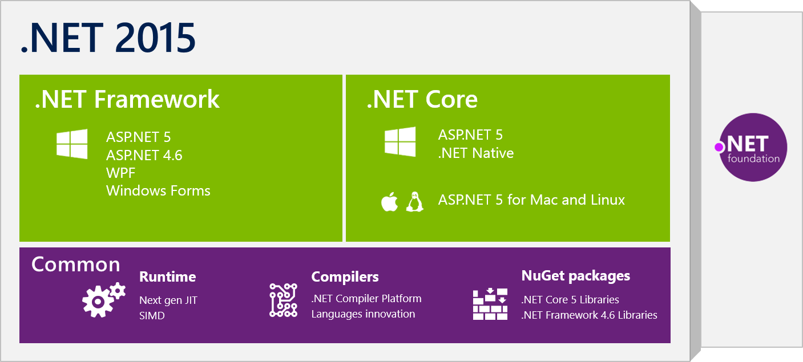

此文章为[微软博客.Net Core 发布 2014-11-12](https://devblogs.microsoft.com/dotnet/net-core-is-open-source/)

Today is a huge day for .NET! We’re happy to announce that .NET Core will be open source, including the runtime as well as the framework libraries.

This is a natural progression of our open source efforts, which already covers the managed compilers (C#, VB, and F#) as well as ASP.NET:

    C# & Visual Basic (“Roslyn”)
    Visual F# Tools
    ASP.NET 5
    Entity Framework

This takes it to the next level by extending it to the .NET runtime and the core framework.

    .NET Core Framework

What is .NET Core?

.NET Core is a modular development stack that is the foundation of all future .NET platforms It’s already used by ASP.NET 5 and .NET Native. I’ll go into more detail on what NET Core is and how it relates to the NET Framework in a following blog post.

Why do we open source .NET Core?

There are two big reasons why we decided to open source .NET Core:

    Lay the foundation for a cross platform .NET
    Build and leverage a stronger ecosystem

# Announcing .Net Core 1.0

此文章为[微软博客.Net Core 1.0发布 2016-06-27](https://devblogs.microsoft.com/dotnet/announcing-net-core-1-0/)

We are excited to announce the release of .NET Core 1.0, ASP.NET Core 1.0 and Entity Framework Core 1.0, available on Windows, OS X and Linux! .NET Core is a cross-platform, open source, and modular .NET platform for creating modern web apps, microservices, libraries and console applications.

This release includes the .NET Core runtime, libraries and tools and the ASP.NET Core libraries. We are also releasing Visual Studio and Visual Studio Code extensions that enable you to create .NET Core projects. You can get started at https://dot.net/core. Read the release notes for detailed release information.

The Visual Studio team also released Visual Studio 2015 Update 3 today. You need that release to build .NET Core apps in Visual Studio.

# Announcing .NET Core 2.0 
 
此文章为[微软博客.Net Core 2.0发布 2016-06-27](https://devblogs.microsoft.com/dotnet/announcing-net-core-2-0/)

.NET Core 2.0 is available today as a final release. You can start developing with it at the command line, in your favorite text editor, in Visual Studio 2017 15.3, Visual Studio Code or Visual Studio for Mac. It is ready for production workloads, on your own hardware or your favorite cloud, like Microsoft Azure.

We are also releasing ASP.NET Core 2.0 and Entity Framework Core 2.0. Read the ASP.NET Core 2.0 and the Entity Framework Core 2.0 announcements for details. You can also watch the launch video on Channel 9 to see many of the new features in action.

The .NET Standard 2.0 spec is complete, finalized at the same time as .NET Core 2.0. .NET Standard is a key effort to improve code sharing and to make the APIs available in each .NET implementation more consistent. .NET Standard 2.0 more than doubles that set of APIs that you have available for your projects.

.NET Core 2.0 has been deployed to Azure Web Apps. It is now available in all Azure regions.

# Announcing .NET Core 3.0 

此文章为[微软博客.Net Core 3.0发布 2016-06-27](https://devblogs.microsoft.com/dotnet/announcing-net-core-3-0/)

We’re excited to announce the release of .NET Core 3.0. It includes many improvements, including adding Windows Forms and WPF, adding new JSON APIs, support for ARM64 and improving performance across the board. C# 8 is also part of this release, which includes nullable, async streams, and more patterns. F# 4.7 is included, and focused on relaxing syntax and targeting .NET Standard 2.0. You can start updating existing projects to target .NET Core 3.0 today. The release is compatible with previous versions, making updating easy.

Visual Studio 2019 16.3 and Visual Studio for Mac 8.3 were also released today and are required update to use .NET Core 3.0 with Visual Studio. .NET Core 3.0 is part of Visual Studio 2019 16.3. You can just get .NET Core by simply upgrading Visual Studio 2019 16.3.