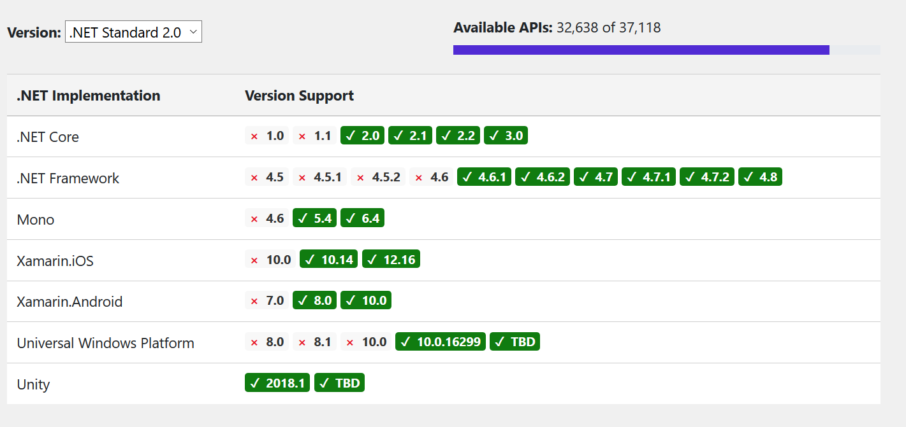
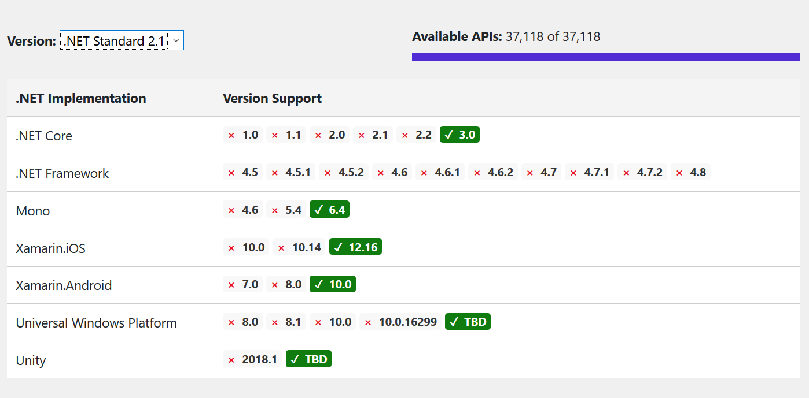

# .Net Standard

A formal specification of the APIs that are common across .NET implementations

There are various implementations of .NET. Each implementation allows .NET code to execute in different places—Linux, macOS, Windows, iOS, Android, and many more. .NET Standard is a formal specification of the APIs that are common across all these .NET implementations.

.NET Standard,是一个标准,所有.NET平台，必须要支持这个.NET Standard里定义的API.
比如说System.IO.FileSystem，Linux下的.NET Core就必须理解Linux平台下的文件系统并且实现Linux下的文件读写功能。跑在Windows下的.NET Core或者.NET Framework也必须实现一份Windows下的文件读写功能。

## .Net Implementations (Runtimes)

* .Net Framework
* .Net Core
* Mono

# .Net Standard Versions

.NET Standard is versioned. Each new version adds more APIs. When a library is built against a certain version of .NET Standard, it can run on any .NET implementation that implements that version of .NET Standard (or higher).

Targeting a higher version of .NET Standard allows a library to use more APIs, but means it can only be used on more recent versions of .NET. Targeting a lower version reduces the available APIs, but means the library can run in more places.

使用高版本的标准,可以使用更多API,但是也带来了更少的可支持runtimes环境.

